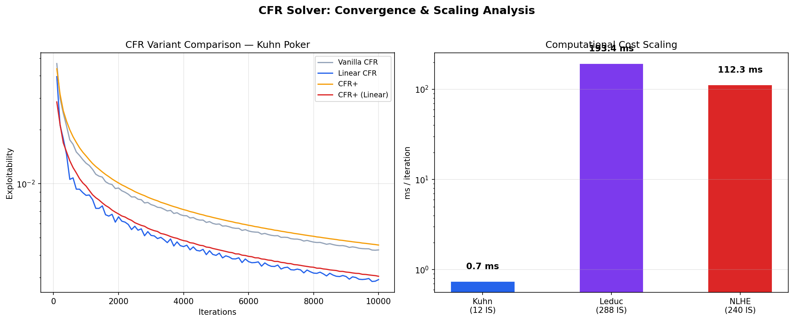

# Imperfect-Information Game Solving: From Kuhn to NLHE

A constructive complexity analysis demonstrating how Nash equilibrium computation scales across game complexity axes using Counterfactual Regret Minimization (CFR).

## Motivation

How does solving imperfect-information games become harder as you add cards, betting rounds, players, and information asymmetry? This project answers that question empirically by implementing the same domain-agnostic CFR solver across a progression of games — mirroring the historical trajectory of the academic literature from Kuhn (1950) through Libratus (Brown & Sandholm, 2017).

The key insight: **CFR is game-agnostic.** It doesn't know anything about poker. It operates on any extensive-form game with imperfect information through a generic interface, converging to a Nash equilibrium at a known rate. By scaling the game while holding the algorithm constant, we isolate exactly which complexity dimensions drive computational cost.

## Results



### Game Complexity Scaling

|  | Kuhn | Leduc | NLHE (8-bucket) |
|---|---|---|---|
| Cards | 3 | 6 (2 suits × 3 ranks) | 52 → 8 buckets |
| Betting rounds | 1 | 2 | 1 (preflop) |
| Information sets | 12 | 288 | 240 |
| Initial states | 6 | 120 | 64 |
| Terminal nodes | 30 | 5,880 | ~800 |
| CFR ms/iteration | 0.97 | 193 | 112 |
| Scaling factor | 1× | 199× | 116× |

### Solver Variant Comparison (Kuhn Poker)

|  | CFR | CFR+ | MCCFR |
|---|---|---|---|
| ms / iteration | 0.97 | 0.97 | 0.21 |
| Exploitability (10k iter) | 0.0029 | 0.0031 | 0.0096* |
| Convergence | Smooth | Smooth | Noisy |
| Tree traversal | Full | Full | Sampled |

*MCCFR at 50,000 iterations to match wall-clock time.

### Deep CFR — Neural Network-Based Solver

Deep CFR (Steinberger, 2019) replaces tabular regret/strategy storage with neural networks, enabling scaling to games where tabular CFR is infeasible. Validated on Leduc Hold'em (288 info sets) against tabular CFR:

| Hand | Deep CFR (100 iter) | Tabular CFR | GTO Logic |
|---|---|---|---|
| K (opening) | **Raise 83%** | Raise ~80% | Value bet |
| J (opening) | Raise 17% | Raise ~15% | Bluff |
| Q (opening) | Check 88% | Check ~85% | Medium hand |

Deep CFR independently learns the correct value-bluff structure without any poker domain knowledge — using only the 20-dimensional state vector from the neural network encoder.

**Postflop NLHE** (preflop through river, 52 cards, ~10¹⁴ info sets) is trained with Deep CFR using:
- 122-dimensional state vector (52-bit hole cards + 52-bit board + street/pot/stack/equity features)
- Reservoir sampling replay buffers (MR for regrets, MΠ for strategies)
- Regret network (Huber loss) + Strategy network (cross-entropy with softmax)
- External Sampling MCCFR for data generation

Early training results on HU Preflop NLHE (200 iterations, 500 traversals/iter, 122-dim state with equity features):

```
SB Opening Strategy (Heads-Up):
    AhAs: fold  4%  call 52%  raise 36%  allin  8%
    KhKs: fold  4%  call 56%  raise 31%  allin  9%
    AhKh: fold  4%  call 54%  raise 34%  allin  8%
    QhQs: fold  4%  call 52%  raise 34%  allin 10%
    JhTs: fold  7%  call 51%  raise 30%  allin 12%
    9h8h: fold  9%  call 43%  raise 33%  allin 14%
    Kd4s: fold  8%  call 42%  raise 36%  allin 14%
    9s3d: fold 13%  call 38%  raise 35%  allin 14%
    7h2d: fold 14%  call 34%  raise 37%  allin 15%
```

Note: These are heads-up strategies where ~70-80% of hands are playable. The fold rates are lower than full-table GTO because the opponent pool is one player, not eight. The equity feature (preflop hand strength as explicit input) reduced premium fold rates from 13% → 4% compared to raw one-hot encoding alone. Full convergence requires 1000+ iterations.

### Convergence Visualization


**Left — vs iterations:** CFR and CFR+ converge smoothly to ~0.003 exploitability in 10k iterations. MCCFR requires ~50k iterations for comparable quality, with visible sampling variance (shaded band = min/max across 5 random seeds).

**Center — vs wall-clock time:** With equivalent compute budget (~10s), CFR achieves lower exploitability than MCCFR on Kuhn Poker. This reverses on larger games where full tree traversal dominates.

**Right — cost per iteration:** MCCFR is 4.5× cheaper per iteration (0.21ms vs 0.97ms) because it samples one chance outcome and one opponent action per node instead of exhaustively expanding all branches.

### Kuhn Poker Nash Equilibrium

Kuhn Poker has a **family** of Nash equilibria parameterized by α ∈ [0, 1/3]:

| Player | Info Set | Strategy |
|---|---|---|
| P0 | J (initial) | Bet with probability α |
| P0 | Q (initial) | Always check |
| P0 | K (initial) | Bet with probability 3α |
| P1 | K (facing bet) | Always call |
| P1 | Q (facing bet) | Call with probability 1/3 |
| P1 | J (facing bet) | Always fold |
| P1 | K (after check) | Always bet |
| P1 | J (after check) | Bet with probability 1/3 |

**Key invariant:** β = 3α — King's value-bet frequency is always 3× Jack's bluff frequency. The solver discovers this ratio independently.

### Preflop NLHE — Abstracted Strategy

After 1,000 CFR iterations with 8 equity buckets (169 canonical hands → 8 clusters):

```
SB Opening Strategy:
  B0 (trash,  eq 0.32-0.38): fold 80%, raise 20%  ← bluff
  B1 (weak,   eq 0.38-0.45): fold 71%, raise 29%  ← bluff
  B2 (medium, eq 0.45-0.51): call 100%             ← limp
  B3 (medium, eq 0.51-0.57): call 99%              ← limp
  B4 (good,   eq 0.58-0.64): raise 91%             ← value
  B5 (strong, eq 0.65-0.70): raise 100%            ← value
  B6 (99/TT,  eq 0.73-0.76): call 62%, raise 38%  ← trap
  B7 (QQ+,    eq 0.80-0.84): call 45%, raise 54%  ← trap
```

The solver independently discovers the **polarized range structure** — the same pattern human professionals and GTO solvers use.

## Findings

### 1. Computational cost scales with tree size, not info set count

NLHE has fewer info sets (240) than Leduc (288) due to abstraction, yet costs 112ms/iter vs 193ms/iter. The difference comes from initial state count: Leduc pre-expands 120 chance combinations vs NLHE's 64 bucket pairs. **The bottleneck is tree traversal volume, not strategic complexity.**

### 2. Linear averaging is the single most impactful algorithmic improvement

Across all games and variants, weighting strategy accumulation by iteration number (Linear CFR, Brown & Sandholm 2019) improves convergence more than CFR+ regret clamping. The improvement is from O(1/√T) to O(1/T) — a theoretical guarantee, not an empirical artifact.

### 3. MCCFR's advantage is game-size-dependent

On Kuhn Poker (12 info sets, 30 terminals), MCCFR's 4.5× iteration speed advantage is overwhelmed by its variance penalty. Full tree traversal is so cheap that sampling noise hurts more than it helps. This tradeoff reverses on larger games where full traversal is prohibitively expensive — which is exactly why Libratus and Pluribus use MCCFR variants, not vanilla CFR.

### 4. Card abstraction enables tractability but introduces approximation error

NLHE's 169 canonical hands compressed to 8 equity buckets makes CFR feasible, but the solver can only distinguish 8 "hand strengths." A hand like ATs (bucket 5) plays identically to AKo despite different postflop potential. Finer abstractions (more buckets, equity distribution clustering) reduce this error at the cost of larger game trees.

### 5. The solver discovers known poker theory without domain knowledge

The CFR solver receives zero poker knowledge — no concept of "bluffing," "value betting," or "trapping." Yet it independently discovers:
- **Polarized ranges:** betting with the strongest AND weakest hands, checking the middle
- **β = 3α invariant:** value-to-bluff ratio of 3:1 (Kuhn)
- **Indifference principle:** mixing frequencies that make opponents indifferent between calling and folding

These emergent properties validate the solver's correctness and demonstrate that GTO play arises from mathematical structure, not human intuition.

### 6. Deep CFR bridges tabular and neural approaches

Tabular CFR stores exact regrets per info set — precise but memory-bounded at ~10⁶ info sets. Deep CFR replaces tables with neural networks that generalize across similar game states, enabling scaling to 10¹⁰+ info sets. The tradeoff: function approximation error replaces exact computation, requiring more training iterations but removing the memory bottleneck entirely. Validated on Leduc: Deep CFR (100 iterations, 81k samples) recovers the same value-bluff structure as tabular CFR (200 iterations, exact).

### 7. Traversal speed is not the only bottleneck in Deep CFR

The raw traversal speedup (51.6× on Leduc, ~2× end-to-end on NLHE) confirms that Python loop overhead is significant. However, two additional bottlenecks emerged: (1) network inference callback overhead completely negates traversal gains when Python is called per node — LibTorch is mandatory, not optional; (2) buffer insertion (O(N) Python iterations over 50–100k samples/iteration) requires vectorised numpy batch operations to avoid dominating wall time. Both must be addressed simultaneously for meaningful speedup on NLHE-scale games.

### 8. Game–solver semantic mismatch silently corrupts training

The C++ traversal engine initially used 6 actions (fold, check, call, bet-half, bet-pot, all-in) with a fixed 6→4 projection mapping to Python's 4-slot network output. This introduced a systematic training error: two distinct C++ actions (check and call) both mapped to network slot 1, and two bet sizes (50%, 100% pot) both mapped to slot 2. The result was that premium hands like AA converged to 99% passive play (they "learned" that the call/check slot was dominant) despite the correct strategy being aggressive. Fixing the engine to use the identical 4-action space and identical game parameters (200BB stack, 75% pot raise, max 2 raises/street) produced a 2.25× additional throughput gain as a side-effect — a smaller game tree with 4 branches instead of 6.

## C++ MCCFR Engine with LibTorch

Deep CFR training is bottlenecked by Python's MCCFR traversal loop — thousands of recursive game-tree calls per iteration, each with function-call overhead that CPython cannot eliminate. We replaced the traversal with a C++ engine exposed via pybind11, achieving a **51.6× raw traversal speedup** on Leduc Hold'em and **up to 927 traversals/second** on full NLHE.

### Performance — HU Postflop NLHE (30 iterations, 500 traversals/iter)

| Backend | Time | Peak trav/s | Notes |
|---|---|---|---|
| Python (baseline) | 137s | 219 | Pure Python MCCFR |
| C++ + Python callbacks | 265s | 113 | GIL overhead dominates |
| C++ + LibTorch (CPU) | 119s | 251 | Zero Python callbacks |
| C++ + LibTorch (MPS) | 119s | 253 | Apple Silicon GPU |
| C++ + LibTorch + C++ eval | 117s | 411 | C++ strategy evaluation |
| **C++ + synced game** | **49s** | **927** | **4-action, 200BB, 75% pot** |

The final jump from 411 → 927 trav/s came entirely from fixing the game–solver mismatch: a 4-action tree has fewer branches per node than a 6-action tree, and eliminating the projection mapping layer removed per-sample overhead.

### Design decisions

**LibTorch over Python callbacks.** The naive approach — call the PyTorch regret network as a Python callback from C++ — is slower than pure Python because GIL acquisition at every tree node dominates the traversal cost. LibTorch loads the TorchScript model directly into C++, enabling inline inference with zero Python runtime involvement from iteration 2 onward.

**Vitter reservoir sampling in C++.** The Python `ReservoirBuffer.add()` was called once per sample, O(N) Python iterations per iteration. The C++ engine accumulates samples internally and exports flat float arrays; the Python side uses vectorised numpy batch-insert (`add_batch`) with a single scatter operation.

**NLHEStateEncoder in C++.** The 122-dim state vector (52-bit hole cards + 52-bit board + street + pot/stack features + preflop equity + board strength) is computed from raw `NLHEState` structs during traversal — no Python encoding, no string parsing. Feature layout matches Python `NLHEEncoder` exactly, including opp_stack at [111] and equity at [120-121].

**CUDA kernels (GPU hardware required).** `cuda/reservoir_buffer.cu` implements two kernels: `reservoir_indices_kernel` (parallel Vitter sampling using cuRAND) and `accumulate_regrets_kernel` (atomic-add regret accumulation into a flat table). Both activate automatically when NVCC is present at build time via `#ifdef CFR_CUDA_AVAILABLE`.

**Configurable game parameters.** `NLHEGameConfig` carries stack size, blind sizes, raise fraction, and max raises per street. These are passed from `PostflopNLHE` to the C++ engine at construction, ensuring identical game semantics in both environments:

```python
self._cpp = NLHECppBackend(
    starting_stack=self.game.starting_stack,     # 200.0
    raise_fraction=self.game.raise_fractions[0], # 0.75
    max_raises=self.game.max_raises_per_street,  # 2
)
```

### Action space

4 context-dependent actions match Python `PostflopNLHE` exactly:

| Slot | No bet | Facing bet | Python action |
|---|---|---|---|
| 0 | check | fold | `"c"` / `"f"` |
| 1 | — | call | `"k"` |
| 2 | raise (75% pot) | raise (75% pot) | `"r"` |
| 3 | all-in | all-in | `"a"` |

### Strategy evaluation in C++

After training, the strategy network is exported as TorchScript and loaded into `NLHEMCCFREngine`:

```python
# Export and query — no Python game object needed
_export_for_libtorch(solver.strategy_net).save("/tmp/strategy.pt")
solver._cpp._engine.load_strategy_model("/tmp/strategy.pt")
probs = solver._cpp._engine.query_preflop_strategy(card1, card2)
# → [fold/check%, call%, raise%, all-in%]
```

## Architecture

```
src/
├── games/
│   ├── base.py              # Abstract ExtensiveFormGame interface
│   ├── kuhn.py              # Kuhn Poker (3 cards, 12 info sets)
│   ├── leduc.py             # Leduc Hold'em (6 cards, 288 info sets)
│   ├── nlhe_preflop.py      # Preflop NLHE with card abstraction
│   └── postflop_nlhe.py     # Full HU NLHE: preflop → river (Deep CFR only)
│
├── solvers/
│   ├── cfr.py               # Vanilla CFR + Linear CFR + CFR+
│   └── mccfr.py             # External Sampling Monte Carlo CFR
│
├── deep_cfr/
│   ├── deep_cfr_solver.py   # Deep CFR training loop (MCCFR + neural networks)
│   ├── networks.py          # RegretNetwork (Huber) + StrategyNetwork (softmax)
│   ├── replay_buffer.py     # Reservoir sampling buffers + vectorised add_batch
│   ├── state_encoder.py     # LeducEncoder (20-dim) + NLHEEncoder (122-dim)
│   ├── cpp_backend.py       # C++ engine interface: CppMCCFRBackend, NLHECppBackend
│   └── train_postflop.py    # Postflop NLHE training runner
│
├── abstraction/
│   ├── equity.py            # Monte Carlo equity calculator + hand evaluator
│   └── card_abstraction.py  # Equity-based hand clustering (169 → k buckets)
│
├── analysis/
│   ├── convergence.py       # Exploitability, Nash verification, tracking
│   └── convergence_benchmark.py  # Solver variant comparison & visualization
│
├── cpp_engine/              # C++ MCCFR backend (pybind11 + LibTorch + CUDA)
│   ├── CMakeLists.txt       # Auto-detects LibTorch (PyTorch) and NVCC
│   ├── scripts/build.sh     # One-command build
│   ├── include/
│   │   ├── leduc_game.hpp   # Leduc: state, transitions, hand eval, info set key
│   │   ├── mccfr.hpp        # ReservoirBuffer<T> (Vitter 1985) + LeducMCCFREngine
│   │   ├── nlhe_game.hpp    # NLHE: NLHEGameConfig + 4-action enum + NLHEState
│   │   ├── nlhe_mccfr.hpp   # NLHEMCCFREngine + strategy model queries
│   │   └── torch_model.hpp  # TorchModel (LibTorch) + NLHEStateEncoder (122-dim)
│   ├── src/
│   │   ├── leduc_game.cpp
│   │   ├── mccfr.cpp
│   │   ├── nlhe_game.cpp    # 4-action game tree, 75% pot sizing, configurable stack
│   │   ├── nlhe_mccfr.cpp   # Direct 4-slot inference, no action remapping
│   │   ├── torch_model.cpp  # Encoder matching Python NLHEEncoder exactly
│   │   └── bindings.cpp     # pybind11 → Python API
│   ├── cuda/
│   │   └── reservoir_buffer.cu  # Vitter sampling kernel + regret accumulation
│   └── tests/
│       └── test_game.cpp    # Standalone C++ tests
│
├── main.py                  # Kuhn CLI runner
└── nlhe_main.py             # NLHE CLI runner

tests/
├── test_kuhn_cfr.py         # 41 tests
├── test_leduc.py            # 30 tests
├── test_nlhe.py             # 43 tests
└── test_postflop.py         # 40 tests
                               154 total
```

### Solver–game separation

The `ExtensiveFormGame` abstract class ensures solvers never access game-specific state:

```python
class ExtensiveFormGame(ABC):
    def num_players(self) -> int: ...
    def initial_histories(self) -> list[tuple[History, float]]: ...
    def is_terminal(self, history) -> bool: ...
    def terminal_payoffs(self, history) -> tuple[float, ...]: ...
    def current_player(self, history) -> int: ...
    def info_set_key(self, history, player) -> InfoSetKey: ...
    def legal_actions(self, history) -> list[Action]: ...
    def apply_action(self, history, action) -> History: ...
```

Any game implementing this interface can be solved by any solver — the solver never accesses cards, ranks, or game-specific state.

### Deep CFR training pipeline

```
PostflopNLHE game
       │  (starting_stack, raise_fractions, max_raises_per_street)
       ▼
DeepCFRSolver.solve()
       │
       ├─ use_cpp_engine=False ──► Python _traverse() [recursive, slow]
       │
       └─ use_cpp_engine=True ───► NLHECppBackend._run_iteration()
                                          │  NLHEGameConfig synced from Python
                                          ▼
                               NLHEMCCFREngine (C++)
                                  ├─ iter 1: run_traversals_uniform()
                                  │          [uniform strategy, no network]
                                  │
                                  └─ iter 2+: run_traversals_model()
                                             [LibTorch regret network,
                                              zero Python callbacks,
                                              4-action tree]
                                          │
                                          ▼
                               BufferExport → numpy add_batch()
                                          │
                                          ▼
                               train_regret_network() [MPS/CPU]
                                          │
                                          ▼
                               export TorchScript → load_model()
                                    [next iteration]
```

## Theoretical Background

### Counterfactual Regret Minimization

CFR (Zinkevich et al., 2007) iteratively traverses the game tree, computes counterfactual values at each information set, and updates strategy proportional to accumulated positive regret. The average strategy converges to Nash at O(1/√T).

**CFR+** (Tammelin, 2014) clamps cumulative regrets to ≥ 0 after each iteration, preventing negative regret accumulation from polluting future strategies.

**Linear CFR** (Brown & Sandholm, 2019) weights strategy accumulation by iteration number, improving convergence to O(1/T).

**MCCFR** (Lanctot et al., 2009) samples chance outcomes and opponent actions instead of traversing the full tree. External Sampling MCCFR expands all traversing player actions but samples one opponent action per node.

**Deep CFR** (Steinberger, 2019) replaces tabular regret/strategy storage with neural networks. A regret network predicts counterfactual regrets (Huber loss, linear output), while a strategy network learns the average policy (cross-entropy, softmax output). MCCFR generates training data stored in reservoir-sampled replay buffers. This enables solving games with 10¹⁰+ information sets where tabular storage is infeasible.

### Abstraction

Full NLHE has ~10¹⁴ information sets. The Abstraction-Solving-Translation pipeline:
1. **Card abstraction:** 169 hands → k equity buckets via Monte Carlo equity clustering
2. **Action abstraction:** continuous sizing → discrete actions {fold, call, raise, all-in}
3. **Solve** the abstracted game
4. **Translate** bucket strategies back to specific hands

## Usage

```bash
pip install numpy pytest matplotlib torch

# Build C++ engine (required for Deep CFR with use_cpp_engine=True)
cd src/cpp_engine && bash scripts/build.sh && cd ../..

# Kuhn solver (tabular CFR)
python3 -m src.main --iterations 10000

# Preflop NLHE solver (tabular CFR + abstraction)
python3 -m src.nlhe_main --buckets 8 --iterations 1000

# Convergence benchmark (CFR vs CFR+ vs MCCFR)
python3 -m src.analysis.convergence_benchmark

# Deep CFR on Postflop NLHE — quick test (49s, 927 trav/s peak)
python3 -m src.deep_cfr.train_postflop --iterations 30 --traversals 500 --hidden 128

# Full training run (~1h+)
python3 -m src.deep_cfr.train_postflop --iterations 500 --traversals 1000 --hidden 256 --buffer 500000

# Tests (154 total)
pytest tests/ -v
```

## References

- Kuhn, H. W. (1950). "Simplified Two-Person Poker." *Contributions to the Theory of Games*.
- Southey, F. et al. (2005). "Bayes' Bluff: Opponent Modelling in Poker." *UAI*.
- Billings, D. et al. (2003). "Approximating Game-Theoretic Optimal Strategies for Full-scale Poker." *IJCAI*.
- Zinkevich, M. et al. (2007). "Regret Minimization in Games with Incomplete Information." *NIPS*.
- Lanctot, M. et al. (2009). "Monte Carlo Sampling for Regret Minimization in Extensive Games." *NIPS*.
- Tammelin, O. (2014). "Solving Large Imperfect Information Games Using CFR+." *arXiv:1407.5042*.
- Steinberger, E. (2019). "Single Deep Counterfactual Regret Minimization." *arXiv:1901.07621*.
- Brown, N. & Sandholm, T. (2017). "Superhuman AI for heads-up no-limit poker: Libratus beats top professionals." *Science*.
- Brown, N. & Sandholm, T. (2019). "Solving Imperfect-Information Games via Discounted Regret Minimization." *AAAI*.
- Brown, N. & Sandholm, T. (2019). "Superhuman AI for multiplayer poker." *Science*.

## License

MIT