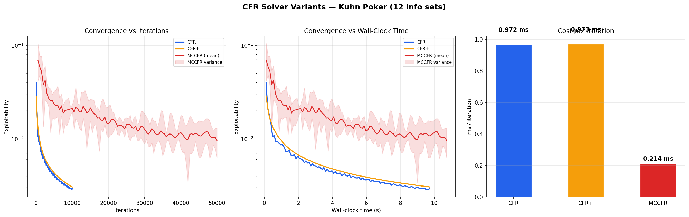
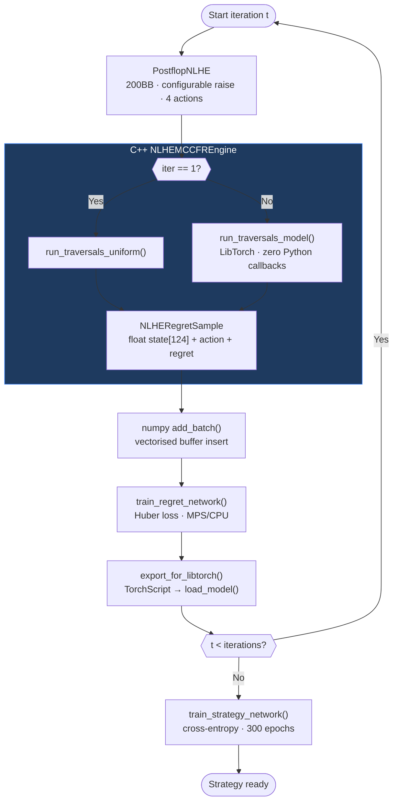

# Imperfect-Information Game Solving: From Kuhn to NLHE

https://imperfect-information-game.org

A constructive complexity analysis demonstrating how Nash equilibrium computation scales across game complexity axes using Counterfactual Regret Minimization (CFR).

## Motivation

How does solving imperfect-information games become harder as you add cards, betting rounds, players, and information asymmetry? This project answers that question empirically by implementing the same domain-agnostic CFR solver across a progression of games — mirroring the historical trajectory of the academic literature from Kuhn (1950) through Libratus (Brown & Sandholm, 2017).

The key insight: **CFR is game-agnostic.** It operates on any extensive-form game with imperfect information through a generic interface, converging to a Nash equilibrium at a known rate. By scaling the game while holding the algorithm constant, we isolate exactly which complexity dimensions drive computational cost.

### Why Deep CFR?

Tabular CFR converges exactly but stores one regret value per information set in memory. This is feasible for Kuhn (12 info sets) and Leduc (288), but full HU NLHE has ~10¹⁴ information sets — several orders of magnitude beyond any table. **Deep CFR** (Steinberger, 2019) replaces tables with neural networks that generalize across game states, removing the memory ceiling at the cost of function approximation error. The C++ MCCFR engine, LibTorch integration, and state-vector buffers documented here exist specifically to make Deep CFR tractable on consumer hardware — reducing training time from hours to minutes while preserving correct game semantics.

## Results

### Game Complexity Scaling

|  | Kuhn | Leduc | NLHE (8-bucket) |
|---|---|---|---|
| Cards | 3 | 6 (2 suits × 3 ranks) | 52 → 8 buckets |
| Betting rounds | 1 | 2 | 1 (preflop) |
| Information sets | 12 | 288 | 240 |
| Initial states | 6 | 120 | 64 |
| Terminal nodes | 30 | 5,880 | ~800 |
| CFR ms/iteration | 0.97 | 193 | 112 |
| Scaling factor | 1× | 199× | 116× |

### Solver Variant Comparison (Kuhn Poker)

|  | CFR | CFR+ | MCCFR |
|---|---|---|---|
| ms / iteration | 0.97 | 0.97 | 0.21 |
| Exploitability (10k iter) | 0.0029 | 0.0031 | 0.0096* |
| Convergence | Smooth | Smooth | Noisy |
| Tree traversal | Full | Full | Sampled |

*MCCFR at 50,000 iterations to match wall-clock time.

### Deep CFR — Neural Network-Based Solver

Validated on Leduc Hold'em (288 info sets) against tabular CFR:

| Hand | Deep CFR (100 iter) | Tabular CFR | GTO Logic |
|---|---|---|---|
| K (opening) | **Raise 83%** | Raise ~80% | Value bet |
| J (opening) | Raise 17% | Raise ~15% | Bluff |
| Q (opening) | Check 88% | Check ~85% | Medium hand |

Deep CFR independently learns the correct value-bluff structure without any poker domain knowledge — using only the 20-dimensional state vector from the neural network encoder.

Results on HU Postflop NLHE after 1000 iterations (500 traversals/iter, hidden=256, 200BB):

```
SB Opening Strategy (Heads-Up):
    AhAs: fold  0%  call 50%  raise 50%  allin  0%
    KhKs: fold  0%  call 62%  raise 38%  allin  0%
    QhQs: fold  0%  call 37%  raise 63%  allin  0%
    JhTs: fold  0%  call 54%  raise 46%  allin  0%
    9h8h: fold  0%  call 65%  raise 35%  allin  0%
    9s3d: fold  0%  call 89%  raise 11%  allin  0%
    7h2d: fold  0%  call100%  raise  0%  allin  0%
```

Premium hands (AA, KK, QQ) raise 38–63%, connectors mix raise/call, weak hands predominantly call. Fold frequencies for the weakest hands remain underrepresented at 1000 iterations — full convergence requires more compute.

### Convergence Visualization



**Left — vs iterations:** CFR and CFR+ converge smoothly to ~0.003 exploitability in 10k iterations. MCCFR requires ~50k iterations for comparable quality, with visible sampling variance.

**Center — vs wall-clock time:** With equivalent compute budget, CFR achieves lower exploitability than MCCFR on Kuhn Poker. This reverses on larger games where full tree traversal dominates.

**Right — cost per iteration:** MCCFR is 4.5× cheaper per iteration (0.21ms vs 0.97ms) because it samples one chance outcome and one opponent action per node.

### Kuhn Poker Nash Equilibrium

Kuhn Poker has a **family** of Nash equilibria parameterized by α ∈ [0, 1/3]:

| Player | Info Set | Strategy |
|---|---|---|
| P0 | J (initial) | Bet with probability α |
| P0 | Q (initial) | Always check |
| P0 | K (initial) | Bet with probability 3α |
| P1 | K (facing bet) | Always call |
| P1 | Q (facing bet) | Call with probability 1/3 |
| P1 | J (facing bet) | Always fold |
| P1 | K (after check) | Always bet |
| P1 | J (after check) | Bet with probability 1/3 |

**Key invariant:** β = 3α — King's value-bet frequency is always 3× Jack's bluff frequency. The solver discovers this ratio independently.

### Preflop NLHE — Abstracted Strategy

After 1,000 CFR iterations with 8 equity buckets (169 canonical hands → 8 clusters):

```
SB Opening Strategy:
  B0 (trash,  eq 0.32-0.38): fold 80%, raise 20%  ← bluff
  B1 (weak,   eq 0.38-0.45): fold 71%, raise 29%  ← bluff
  B2 (medium, eq 0.45-0.51): call 100%             ← limp
  B3 (medium, eq 0.51-0.57): call 99%              ← limp
  B4 (good,   eq 0.58-0.64): raise 91%             ← value
  B5 (strong, eq 0.65-0.70): raise 100%            ← value
  B6 (99/TT,  eq 0.73-0.76): call 62%, raise 38%  ← trap
  B7 (QQ+,    eq 0.80-0.84): call 45%, raise 54%  ← trap
```

The solver independently discovers the **polarized range structure** — the same pattern human professionals and GTO solvers use.

## Findings

### 1. Computational cost scales with tree size, not info set count

NLHE has fewer info sets (240) than Leduc (288) due to abstraction, yet costs 112ms/iter vs 193ms/iter. The bottleneck is initial state count: Leduc pre-expands 120 chance combinations vs NLHE's 64 bucket pairs. **The bottleneck is tree traversal volume, not strategic complexity.**

### 2. Linear averaging is the single most impactful algorithmic improvement

Weighting strategy accumulation by iteration number (Linear CFR, Brown & Sandholm 2019) improves convergence from O(1/√T) to O(1/T) — a theoretical guarantee, not an empirical artifact. This outperforms CFR+ regret clamping across all tested games.

### 3. MCCFR's advantage is game-size-dependent

On Kuhn Poker (12 info sets), MCCFR's 4.5× iteration speed advantage is overwhelmed by sampling variance. Full tree traversal is so cheap that noise hurts more than it helps. This tradeoff reverses on larger games — which is exactly why Libratus and Pluribus use MCCFR variants, not vanilla CFR.

### 4. Card abstraction enables tractability but introduces approximation error

NLHE's 169 canonical hands compressed to 8 equity buckets makes CFR feasible, but a hand like ATs (bucket 5) plays identically to AKo despite different postflop potential. Finer abstractions reduce this error at the cost of larger game trees.

### 5. The solver discovers known poker theory without domain knowledge

The CFR solver receives zero poker knowledge. Yet it independently discovers polarized ranges (betting with strongest AND weakest hands), the β = 3α value-to-bluff ratio in Kuhn, and mixing frequencies that make opponents indifferent. GTO play arises from mathematical structure, not human intuition.

### 6. Deep CFR bridges tabular and neural approaches

Tabular CFR is memory-bounded at ~10⁶ info sets. Deep CFR removes the memory ceiling via neural generalization, at the cost of function approximation error requiring more training iterations. Validated on Leduc: Deep CFR (100 iterations, 81k samples) recovers the same value-bluff structure as tabular CFR (200 iterations, exact).

### 7. Traversal speed requires end-to-end optimization

The raw traversal speedup (51.6× on Leduc) does not translate directly to end-to-end speedup. Two additional bottlenecks must be addressed simultaneously: (1) Python GIL overhead on per-node network inference eliminates the traversal gain entirely — LibTorch inline inference is mandatory; (2) O(N) Python buffer insertion dominates at 50–100k samples/iteration and requires vectorised numpy batch operations.

### 8. Pre-computed advisor cache + auxiliary loss can lift Deep CFR past its plateau

Deep CFR's regret network converges to a noisy approximation of the true regret at each info set, capped by network capacity and sample efficiency. Pre-solving a small set of representative public states with deeper local CFR (a "CFR advisor cache") and feeding the resulting action probabilities + EVs into the encoder as extra input dims gives the network ground-truth value information it would otherwise have to learn from scratch. The catch: a naive aux input gets *ignored* — the network finds it can solve regret-matching without the advisor, so the gradient through those dims collapses. Adding an auxiliary EV-prediction head that forces the shared trunk to *reproduce* the cache's EV signal recovers the benefit. The current production blueprint (50BB, 500 iter, cache-augmented) reaches **761 ± 88 mbb/decision** LBR exploitability — a ~210 mbb/dec improvement over the same-budget cache-less baseline (v14d_fixed @ 975 ± 136). The same recipe extends to multi-raise blueprints: a 3-sizing 50BB blueprint with the cache improves from ~1267 to **884 ± 97** mbb/dec (z = +2.09 vs the no-cache baseline).

## C++ MCCFR Engine with LibTorch

### Performance

| Backend | Peak trav/s | Key change |
|---|---|---|
| Python baseline | 219 | Pure Python MCCFR |
| C++ + Python callbacks | 113 | GIL overhead dominates |
| C++ + LibTorch | 251 | Zero Python callbacks |
| C++ + MPS training | 253 | Apple Silicon GPU |
| C++ + C++ eval | 411 | C++ strategy queries |
| C++ + game sync | **927** | 4-action tree, 200BB, 75% pot |
| + state-vector buffer | ~800* | Training = inference features |

*Thermal throttling on MacBook Air after ~150 iterations reduces sustained throughput.

### Design decisions

**State-vector buffers.** Buffer samples store the full 124-dim state vector (float[124]) rather than info-set key strings. The previous string-based approach silently zeroed 9 of 122 features (to_call, my_stack, opp_stack, equity, board_strength) during parsing, causing the regret network to train on incomplete information. Fixing this enabled raise frequencies to differentiate by hand strength (AA 50%, QQ 63%).

**LibTorch over Python callbacks.** GIL acquisition at every tree node completely negates traversal gains. LibTorch loads the TorchScript model directly into C++, enabling inline inference with zero Python involvement from iteration 2 onward.

**Configurable game parameters via NLHEGameConfig.** Stack size, blind sizes, raise fraction, and max raises are passed from `PostflopNLHE` to the C++ engine at construction, ensuring identical game semantics in both environments. A prior mismatch (6-action C++ tree vs 4-action Python game) caused premium hands to converge to passive play — fixing it produced a 2× throughput gain as a side-effect.

**Vitter reservoir sampling in C++.** The C++ engine accumulates samples internally and exports flat float arrays. The Python side uses vectorised `add_batch()` with a single scatter operation instead of O(N) per-sample inserts.

### Lessons learned from Deep CFR at scale

**Game–solver semantic mismatch silently corrupts training.** An initial 6→4 action projection mapped both "check" and "call" to slot 1, and both 50% and 100% pot bets to slot 2. This statistical conflation produced degenerate strategies. The fix requires identical action spaces end-to-end.

**Training and inference feature mismatch causes collapse.** When training features differ from inference features (even silently), the regret network's outputs become uncorrelated with actual regrets. End-to-end feature consistency is a hard requirement.

**The buffer:traversal ratio determines convergence stability.** With 500k reservoir buffer and 500 traversals/iter (0.2% refresh rate), the regret network trains on predominantly stale data and converges to degenerate solutions. Experiments showed that refreshing ~10% of the buffer per iteration (buffer ≈ 10 × traversals_per_iter × 2) prevents staleness while maintaining gradient stability. The strategy buffer benefits from larger capacity to accumulate the time-average strategy across all iterations.

### Action space

4 context-dependent actions matching Python `PostflopNLHE` exactly:

| Slot | No bet | Facing bet | Python action |
|---|---|---|---|
| 0 | check | fold | `"c"` / `"f"` |
| 1 | — | call | `"k"` |
| 2 | raise (configurable % pot) | raise | `"r"` |
| 3 | all-in | all-in | `"a"` |

## Architecture

```
src/
├── games/
│   ├── base.py              # Abstract ExtensiveFormGame interface
│   ├── kuhn.py              # Kuhn Poker (3 cards, 12 info sets)
│   ├── leduc.py             # Leduc Hold'em (6 cards, 288 info sets)
│   ├── nlhe_preflop.py      # Preflop NLHE with card abstraction
│   └── postflop_nlhe.py     # Full HU NLHE: preflop → river (Deep CFR only)
│
├── solvers/
│   ├── cfr.py               # Vanilla CFR + Linear CFR + CFR+
│   └── mccfr.py             # External Sampling Monte Carlo CFR
│
├── deep_cfr/
│   ├── deep_cfr_solver.py   # Deep CFR training loop
│   ├── networks.py          # RegretNetwork (Huber, optional aux-EV head) + StrategyNetwork (softmax)
│   ├── replay_buffer.py     # Reservoir + sliding-window buffers, add_batch
│   ├── state_encoder.py     # LeducEncoder (20-dim) + NLHEEncoder (37/49-dim, cache-augmented)
│   ├── cfr_cache.py         # CFR advisor cache: 64-bit abstraction keys, npz + binary I/O, lookup
│   ├── action_slots.py      # Legal-actions → fixed-slot remapping (handles ALL_IN gap in 4-action mode)
│   ├── cpp_backend.py       # C++ engine interface + export_for_libtorch + cache backfill
│   └── train_postflop.py    # Postflop NLHE training runner
│
├── abstraction/
│   ├── equity.py            # Monte Carlo equity calculator + hand evaluator
│   └── card_abstraction.py  # Equity-based hand clustering (169 → k buckets)
│
├── analysis/
│   ├── convergence.py       # Exploitability, Nash verification, tracking
│   └── convergence_benchmark.py
│
├── cpp_engine/              # C++ MCCFR backend (pybind11 + LibTorch + CUDA)
│   ├── CMakeLists.txt       # Auto-detects LibTorch and NVCC
│   ├── scripts/build.sh
│   ├── include/
│   │   ├── leduc_game.hpp
│   │   ├── mccfr.hpp        # ReservoirBuffer<T> (Vitter 1985)
│   │   ├── nlhe_game.hpp    # NLHEGameConfig + 4-action enum + NLHEState
│   │   ├── nlhe_mccfr.hpp   # NLHERegretSample { float state[49] }
│   │   ├── torch_model.hpp  # TorchModel + NLHEStateEncoder (49-dim, cache-aware)
│   │   └── cfr_cache_loader.hpp  # Binary cache loader (matches cfr_cache.py)
│   ├── src/
│   │   ├── nlhe_game.cpp    # 4-action tree, configurable sizing
│   │   ├── nlhe_mccfr.cpp   # State-vector samples, direct 4-slot inference
│   │   ├── torch_model.cpp  # Encoder matching Python NLHEEncoder + inline cache lookup
│   │   ├── cfr_cache_loader.cpp  # Binary search over sorted uint64 keys
│   │   └── bindings.cpp
│   └── cuda/
│       └── reservoir_buffer.cu  # Vitter sampling + regret accumulation kernels
│
├── main.py
└── nlhe_main.py

tests/   # 154 tests across 4 files
```

### Solver–game separation

The `ExtensiveFormGame` abstract class ensures solvers never access game-specific state:

```python
class ExtensiveFormGame(ABC):
    def legal_actions(self, history) -> list[Action]: ...
    def apply_action(self, history, action) -> History: ...
    def terminal_payoffs(self, history) -> tuple[float, ...]: ...
    def info_set_key(self, history, player) -> InfoSetKey: ...
    # + num_players, initial_histories, is_terminal, current_player
```

Any game implementing this interface can be solved by any solver — Kuhn through full NLHE, tabular CFR through Deep CFR.

### Deep CFR training pipeline



## Theoretical Background

**CFR** (Zinkevich et al., 2007) iteratively traverses the game tree, computes counterfactual values at each information set, and updates strategy proportional to accumulated positive regret. The average strategy converges to Nash at O(1/√T).

**CFR+** (Tammelin, 2014) clamps cumulative regrets to ≥ 0, preventing negative accumulation from polluting future strategies.

**Linear CFR** (Brown & Sandholm, 2019) weights strategy accumulation by iteration number, improving convergence to O(1/T).

**MCCFR** (Lanctot et al., 2009) samples chance outcomes and opponent actions instead of traversing the full tree. External Sampling MCCFR expands all traversing player actions but samples one opponent action per node.

**Deep CFR** (Steinberger, 2019) replaces tabular regret/strategy storage with neural networks — a regret network (Huber loss, linear output) and a strategy network (cross-entropy, softmax output). MCCFR generates training data stored in reservoir-sampled replay buffers. This enables solving games with 10¹⁰+ information sets where tabular storage is infeasible.

**Abstraction pipeline:** 169 canonical hands → k equity buckets (card abstraction) + continuous bet sizing → discrete actions (action abstraction). The solver operates on the abstracted game; strategies translate back to specific hands via the bucket mapping.

## Usage

```bash
pip install numpy pytest matplotlib torch

# Build C++ engine
cd src/cpp_engine && bash scripts/build.sh && cd ../..

# Kuhn solver (tabular CFR)
python3 -m src.main --iterations 10000

# Preflop NLHE (tabular CFR + abstraction)
python3 -m src.nlhe_main --buckets 8 --iterations 1000

# Convergence benchmark (CFR vs CFR+ vs MCCFR)
python3 -m src.analysis.convergence_benchmark

# Deep CFR — quick test (~150s)
python3 -m src.deep_cfr.train_postflop \
  --iterations 100 --traversals 500 --hidden 256

# Full training run
python3 -m src.deep_cfr.train_postflop \
  --iterations 1000 --traversals 500 --hidden 256 \
  --buffer 500000 --epochs 20

# Separate regret/strategy buffer sizes
python3 -m src.deep_cfr.train_postflop \
  --iterations 1000 --traversals 500 --hidden 256 \
  --buffer 10000 --strategy-buffer 200000 --epochs 50

# Tests (154 total)
pytest tests/ -v
```

## References

- Kuhn, H. W. (1950). "Simplified Two-Person Poker." *Contributions to the Theory of Games*.
- Southey, F. et al. (2005). "Bayes' Bluff: Opponent Modelling in Poker." *UAI*.
- Billings, D. et al. (2003). "Approximating Game-Theoretic Optimal Strategies for Full-scale Poker." *IJCAI*.
- Zinkevich, M. et al. (2007). "Regret Minimization in Games with Incomplete Information." *NIPS*.
- Lanctot, M. et al. (2009). "Monte Carlo Sampling for Regret Minimization in Extensive Games." *NIPS*.
- Tammelin, O. (2014). "Solving Large Imperfect Information Games Using CFR+." *arXiv:1407.5042*.
- Steinberger, E. (2019). "Single Deep Counterfactual Regret Minimization." *arXiv:1901.07621*.
- Brown, N. & Sandholm, T. (2017). "Superhuman AI for heads-up no-limit poker: Libratus beats top professionals." *Science*.
- Brown, N. & Sandholm, T. (2019). "Solving Imperfect-Information Games via Discounted Regret Minimization." *AAAI*.
- Brown, N. & Sandholm, T. (2019). "Superhuman AI for multiplayer poker." *Science*.

## License

MIT
